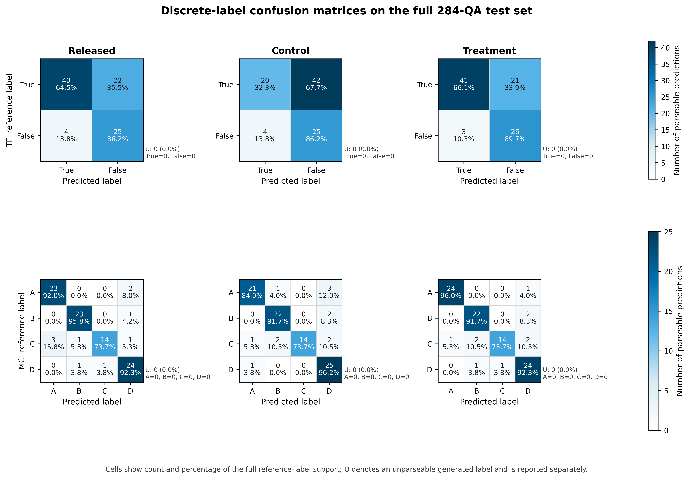

# AXIS loss_e2e_0723 双臂实验结果分析

## 技术摘要

- **分段联合损失在整体指标上有效，但不是全题型无条件改进。** Treatment 的 Macro Final 相对 Control 在 Gemini 2.5 Pro、DeepSeek V4 Pro、Qwen3-30B-A3B-Instruct-2507、Qwen3.5-397B-A17B 下分别提高 4.42%、1.42%、5.34%、4.75%。
- **收益集中在 OE 与 TF。** 四位 Judge 对 OE 的 4 个指标和 TF 的 3 个指标均给出正向变化；其中 TF Final 分别提高 10.22%、6.64%、13.37%、13.76%。
- **MC 存在明确权衡。** MC Final 和 MC Correctness 在四位 Judge 下均下降；MC Reasoning 仅 Gemini 与 Qwen3-30B 判为上升，DeepSeek 与 Qwen3.5 判为下降。因此当前方法不能宣称全面改善 MC。
- **无泄漏选模证据与测试结果方向一致。** seed=72 validation 的 teacher-forced global token NLL 从 0.743755 降至 0.730064（-1.84%），两臂都由预先声明的四个候选选中 step_19000；选模未读取 paper140 或 Judge 分数。
- **完整 284 QA 离散标签诊断揭示 Control 的 TF 决策退化被 Treatment 修复。** TF accuracy 为 Released 71.43%、Control 49.45%、Treatment 73.63%；Treatment 的 MC 纯选项 accuracy 为 89.36%，高于 Control 的 87.23% 并与 Released 持平；三臂离散标签均 100% 可解析。
- **判定：** 若成功标准是提高宏平均并重点改善 OE/TF，则本次改进有效；若成功标准要求 MC/OE/TF 全部不退化，则当前证据不足，下一版应优先修复 MC conclusion/correctness 的回退。

## 四种 Judge 的 Table 1 第一行逐指标对比

本节严格读取八个 `table1.json` 的 `models.base`（Table 1 第一行）。绝对差值定义为 `Treatment − Control`，相对变化定义为 `(Treatment − Control) / Control × 100%`；正值表示 Treatment 更高。

### Gemini 2.5 Pro author-mode

| 指标 | Control | Treatment | 绝对差值 T−C | 相对变化 |
|---|---:|---:|---:|---:|
| MC Final | 4.2186 | 4.2047 | -0.0140 | -0.33% |
| MC Corr. | 4.3023 | 4.2326 | -0.0698 | -1.62% |
| MC Rsn. | 4.0233 | 4.1395 | +0.1163 | +2.89% |
| OE Final | 2.9000 | 3.0527 | +0.1527 | +5.27% |
| OE Acc. | 2.7455 | 3.0182 | +0.2727 | +9.93% |
| OE Comp. | 2.6727 | 2.7273 | +0.0545 | +2.04% |
| OE Rel. | 3.3455 | 3.4727 | +0.1273 | +3.80% |
| TF Final | 3.0286 | 3.3381 | +0.3095 | +10.22% |
| TF Corr. | 3.0000 | 3.3571 | +0.3571 | +11.90% |
| TF Justif. | 3.0714 | 3.3095 | +0.2381 | +7.75% |
| Macro Final | 3.3824 | 3.5318 | +0.1494 | +4.42% |

**解读。** Gemini 判断 Macro Final 提升 +0.1494（+4.42%）。OE/TF 全部改善；MC Reasoning 改善，但 MC Final 与 MC Correctness 分别下降 0.33% 和 1.62%。

### DeepSeek V4 Pro

| 指标 | Control | Treatment | 绝对差值 T−C | 相对变化 |
|---|---:|---:|---:|---:|
| MC Final | 4.2442 | 4.0552 | -0.1890 | -4.45% |
| MC Corr. | 4.3488 | 4.1163 | -0.2326 | -5.35% |
| MC Rsn. | 4.0000 | 3.9128 | -0.0872 | -2.18% |
| OE Final | 2.9569 | 3.0800 | +0.1232 | +4.17% |
| OE Acc. | 2.8546 | 3.0182 | +0.1636 | +5.73% |
| OE Comp. | 2.6482 | 2.7273 | +0.0791 | +2.99% |
| OE Rel. | 3.4363 | 3.5636 | +0.1273 | +3.70% |
| TF Final | 3.2286 | 3.4429 | +0.2143 | +6.64% |
| TF Corr. | 3.1905 | 3.4524 | +0.2619 | +8.21% |
| TF Justif. | 3.2857 | 3.4286 | +0.1429 | +4.35% |
| Macro Final | 3.4765 | 3.5260 | +0.0495 | +1.42% |

**解读。** DeepSeek 判断 Macro Final 提升 +0.0495（+1.42%）。OE/TF 的收益方向与 Gemini 一致，但 MC 的三个指标全部下降，MC Final 相对下降 4.45%。

### Qwen3-30B-A3B-Instruct-2507

| 指标 | Control | Treatment | 绝对差值 T−C | 相对变化 |
|---|---:|---:|---:|---:|
| MC Final | 4.5317 | 4.4086 | -0.1232 | -2.72% |
| MC Corr. | 4.6661 | 4.4487 | -0.2175 | -4.66% |
| MC Rsn. | 4.2181 | 4.3150 | +0.0969 | +2.30% |
| OE Final | 2.7812 | 3.0278 | +0.2466 | +8.87% |
| OE Acc. | 2.4619 | 2.7975 | +0.3355 | +13.63% |
| OE Comp. | 2.7856 | 2.9266 | +0.1410 | +5.06% |
| OE Rel. | 3.1486 | 3.4147 | +0.2662 | +8.45% |
| TF Final | 3.3209 | 3.7648 | +0.4439 | +13.37% |
| TF Corr. | 3.3168 | 3.8668 | +0.5499 | +16.58% |
| TF Justif. | 3.3269 | 3.6119 | +0.2850 | +8.57% |
| Macro Final | 3.5446 | 3.7337 | +0.1891 | +5.34% |

**解读。** Qwen 判断 Macro Final 提升 +0.1891（+5.34%），OE/TF 七项全部改善；MC Reasoning 提升 2.30%，但 MC Final 与 MC Correctness 分别下降 2.72% 和 4.66%。

### Qwen3.5-397B-A17B

| 指标 | Control | Treatment | 绝对差值 T−C | 相对变化 |
|---|---:|---:|---:|---:|
| MC Final | 4.5042 | 4.3739 | -0.1303 | -2.89% |
| MC Corr. | 4.4964 | 4.3826 | -0.1138 | -2.53% |
| MC Rsn. | 4.5224 | 4.3536 | -0.1687 | -3.73% |
| OE Final | 3.0034 | 3.2037 | +0.2004 | +6.67% |
| OE Acc. | 2.7969 | 2.9946 | +0.1976 | +7.07% |
| OE Comp. | 2.9223 | 3.1612 | +0.2389 | +8.17% |
| OE Rel. | 3.3387 | 3.4974 | +0.1587 | +4.75% |
| TF Final | 3.1780 | 3.6153 | +0.4373 | +13.76% |
| TF Corr. | 3.2860 | 3.6644 | +0.3784 | +11.52% |
| TF Justif. | 3.0162 | 3.5418 | +0.5256 | +17.43% |
| Macro Final | 3.5619 | 3.7310 | +0.1691 | +4.75% |

**解读。** Qwen3.5 判断 Macro Final 提升 +0.1691（+4.75%），OE/TF 七项全部改善；MC 的 Final、Correctness 和 Reasoning 分别下降 2.89%、2.53% 和 3.73%。

### 四位 Judge 的方向一致性

| 指标 | Gemini 相对变化 | DeepSeek 相对变化 | Qwen3-30B 相对变化 | Qwen3.5 相对变化 | 方向一致性 |
|---|---:|---:|---:|---:|---|
| MC Final | -0.33% | -4.45% | -2.72% | -2.89% | 四者一致 |
| MC Corr. | -1.62% | -5.35% | -4.66% | -2.53% | 四者一致 |
| MC Rsn. | +2.89% | -2.18% | +2.30% | -3.73% | 不一致 |
| OE Final | +5.27% | +4.17% | +8.87% | +6.67% | 四者一致 |
| OE Acc. | +9.93% | +5.73% | +13.63% | +7.07% | 四者一致 |
| OE Comp. | +2.04% | +2.99% | +5.06% | +8.17% | 四者一致 |
| OE Rel. | +3.80% | +3.70% | +8.45% | +4.75% | 四者一致 |
| TF Final | +10.22% | +6.64% | +13.37% | +13.76% | 四者一致 |
| TF Corr. | +11.90% | +8.21% | +16.58% | +11.52% | 四者一致 |
| TF Justif. | +7.75% | +4.35% | +8.57% | +17.43% | 四者一致 |
| Macro Final | +4.42% | +1.42% | +5.34% | +4.75% | 四者一致 |

**最稳健的结论**是 OE/TF 改善与宏平均提升，因为四位 Judge 方向一致；MC Reasoning 的方向不一致，不能作为确定收益。精确值来自 [Gemini Control](artifacts/control_evaluation/gemini/table1.json)、[Gemini Treatment](artifacts/treatment_evaluation/gemini/table1.json)、[DeepSeek Control](artifacts/control_evaluation/deepseek/table1.json)、[DeepSeek Treatment](artifacts/treatment_evaluation/deepseek/table1.json)、[Qwen3-30B Control](qwen_extension/artifacts/control/table1_qwen.json)、[Qwen3-30B Treatment](qwen_extension/artifacts/treatment/table1_qwen.json)、[Qwen3.5 Control](qwen35_extension/artifacts/control/table1_qwen35.json) 和 [Qwen3.5 Treatment](qwen35_extension/artifacts/treatment/table1_qwen35.json)。

## 无测试泄漏的四里程碑选模

| Step | Control validation NLL | Treatment validation NLL | T−C |
|---:|---:|---:|---:|
| 4750 | 0.754702 | 0.731450 | -0.023251 |
| 9500 | 0.770250 | 0.737074 | -0.033176 |
| 14250 | 0.746273 | 0.730750 | -0.015523 |
| 19000 | 0.743755 | 0.730064 | -0.013691 |

- 两臂候选固定为 step_4750 / 9500 / 14250 / 19000。
- 选模集为 seed=72 的 5% validation：1,500 series、3,000 QA rows、376,696 个有效 answer tokens。
- 指标为有效 answer token 加权的 teacher-forced global token NLL，越低越好；两臂均选中 step_19000。
- Treatment 最佳 NLL 比 Control 低 0.013691（1.84%）。四个里程碑上 Treatment 均低于 Control，说明该方向不是由单一 checkpoint 偶然造成。
- paper140 固定使用 seed=42 manifest；两臂均为 140 条 base predictions、335 个 G-Eval 维度分数。

## 实验设计、配置与数据审计

| 项目 | Control | Treatment |
|---|---|---|
| 初始化 | 同一作者 checkpoint（SHA-256 相同） | 同 Control |
| 优化器 | AdamW，weight decay=1e-5 | 同 Control |
| LR 日程 | epoch 1: 1e-4；epoch 2: 3e-5 | 同 Control |
| 冻结 LLM 精度 | epoch 1: FP16；epoch 2: BF16 | 同 Control |
| 训练 | 3×A100 80GB，2 epochs，19,000 steps，无早停 | 同 Control |
| seed | 训练/validation=72；paper140 manifest=42 | 同 Control |
| 目标 | 全局 continuation-token NLL | conclusion 0.40 + explanation 0.60 的分段目标 |
| fixed hint | dynamic | step 0 缓存 F0，shape=30×3584，重复误差=0 |
| 可训练参数 | 204,076,832 | 203,969,312 |
| 训练 QA | 57,000 总行；56,987 纳入；13 排除 | 完全相同的排除 manifest |
| answer tokenization | fast tokenizer；truncation=False；0 个截断 | 同 Control |
| max answer tokens | 234（model limit 16,384） | 同 Control |

题型纳入量为 MC=18,927、OE=18,912、TF=19,148。Treatment 的确定性切段计数为：MC marker=9,910、MC first line=6,082、MC blank line=1,234、MC first sentence/fallback=1,701、OE first sentence=18,879、OE short-merge=33、TF label+first statement=19,148。

## 训练中间结果与稳定性

| 诊断量 | Control | Treatment | 解释 |
|---|---:|---:|---|
| 训练 global token NLL | 0.754403 | 0.734981 | Treatment 低 2.57%；与 validation 方向一致 |
| Treatment segmented objective | 不适用 | 0.629637 | 与 Control token-mean objective 归一化不同，不直接比较绝对值 |
| conclusion NLL | 不适用 | 0.261570 | conclusion 明显易于 explanation |
| explanation NLL | 不适用 | 0.875016 | 仍是主要误差来源 |
| mean gradient L2 | 0.337378 | 0.056598 | 目标归一化不同，只用于臂内稳定性判断 |
| max gradient L2 | 41.331757 | 102.709160 | Treatment 有更尖锐的稀有峰值 |
| final gradient L2 | 0.312269 | 0.019746 | 两者最终均为有限值 |
| non-finite steps | 0 | 0 | 正式轨迹均为 0 |
| step_19000 参数相对漂移 | 0.206354 | 0.416110 | Treatment 比 Control 高 101.65% |
| 吞吐（step/s/rank） | 1.2971 | 1.2796 | 接近一致 |

Treatment epoch 2 只从完整的 step_9500 epoch 边界恢复，恢复 optimizer 与累计指标，未跳过中途 batch；最终 checkpoint 链记录了该恢复来源。正式汇总的 19,000 个 gradient norm 全部有限。较大的参数漂移与 MC 退化同时出现，提示下一版需要约束 conclusion 权重或加入臂内 drift/MC proxy 监控，但这只是诊断关联，不能据此声称因果。

<!-- FULL284_DISCRETE_LABEL_DIAGNOSTIC_START -->
## 完整 284 QA 的离散标签诊断：Released / Control / Treatment

### 诊断结论

- **Treatment 修复了 Control 的主要 TF 决策退化。** TF accuracy 为 Released 71.43%、Control 49.45%、Treatment 73.63%；Treatment 相对 Control 提高 24.18 个百分点（+48.89%），并相对 Released 提高 2.20 个百分点（+3.08%）。
- **Control 的问题不是无法输出标签，而是严重偏向 False。** 三臂 TF 均为 0 个不可解析；参考分布为 True=62、False=29，但 Control 只预测 24 个 True、67 个 False，True recall 降至 32.26%。Treatment 的预测分布恢复为 True=44、False=47，True recall=66.13%、False recall=89.66%。
- **MC 纯选项决策没有随 Treatment 退化。** MC accuracy 为 Released 89.36%、Control 87.23%、Treatment 89.36%；Treatment 相对 Control 提高 2.13 个百分点（+2.44%），与 Released 准确率持平。Treatment 的 MC macro recall 比 Released 低 0.04 个百分点，原因是 A/B/C/D 类别间误差重新分布。
- **这重新定位了既有 MC G-Eval 回退。** 四位 Judge 都判定 Treatment 的 MC Final/Correctness 低于 Control，但完整测试集的纯选项准确率反而更高。因此，现有证据更支持 MC 回退来自解释、相关性、格式或标签—解释一致性，而不是 A/B/C/D 选择本身；该解释仍需后续语义判定实验验证。
- **三臂均无格式性标签缺失。** TF=91、MC=94，共 185 道离散题；每臂 U=0。OE=99 只参加 284-row 覆盖审计，不进入离散标签指标。

### 统一协议与解析规则

三臂均在同一授权 GPU 节点上重新执行完整 284 QA，而非复用既有 paper140 predictions。运行固定为 3×A100 40GB、`subset=full`、`mode=base`、同一 series 内 QA 批处理、beam size=5、`max_new_tokens=1000`、`skip-loss=true`。full manifest 由 seed=42 流程生成，但 `full` 本身覆盖全部 142 series，不涉及抽样。三臂各自得到 284 个唯一、非空 response，并由同一 manifest 审计为 `ok=true`。

标签解析器版本为 `axis-discrete-label-v1`，对参考答案与原始生成回答使用相同规则：

1. 不删除 `<think>` 或其他前缀，直接在 raw response 中取第一个合法标签。
2. TF：取第一个独立、大小写不敏感的 `True` / `False`；词内子串不算。
3. MC：只接受大写 A/B/C/D，合法形式包括 `Answer: A`、`The answer is A`、`(A)`、`A)`、`A.`、`A:` 或独立大写标签；拒绝小写冠词、词内字母。
4. 生成标签不可解析记为 U，并按错误计入 accuracy 与各类 recall 的分母；本次 U 实测均为 0。
5. 本轮按用户要求暂停解释好/差/一致/矛盾的语义评分，因此不分配依赖解释判定的 A/B/C/D/E 语义类别。逐样本仅记录 `label_correct`、`label_incorrect`、`U`；不能把 `label_correct` 等同于原定义的 A 类。

### 核心指标与三组差值

绝对差值以百分点（pp）表示；相对变化为 `(候选−基线)/基线×100%`。U rate 的基线均为 0，因此相对变化无定义。

| 指标 | Released | Control | Treatment | Control−Released | Treatment−Released | Treatment−Control |
|---|---:|---:|---:|---:|---:|---:|
| 离散题合并 accuracy（185） | 80.54% | 68.65% | 81.62% | -11.89 pp (-14.77%) | +1.08 pp (+1.34%) | +12.97 pp (+18.90%) |
| 合并 U rate | 0.00% | 0.00% | 0.00% | 0.00 pp（相对 N/A） | 0.00 pp（相对 N/A） | 0.00 pp（相对 N/A） |
| TF accuracy（91） | 71.43% | 49.45% | 73.63% | -21.98 pp (-30.77%) | +2.20 pp (+3.08%) | +24.18 pp (+48.89%) |
| TF True recall（n=62） | 64.52% | 32.26% | 66.13% | -32.26 pp (-50.00%) | +1.61 pp (+2.50%) | +33.87 pp (+105.00%) |
| TF False recall（n=29） | 86.21% | 86.21% | 89.66% | 0.00 pp (+0.00%) | +3.45 pp (+4.00%) | +3.45 pp (+4.00%) |
| TF balanced accuracy | 75.36% | 59.23% | 77.89% | -16.13 pp (-21.40%) | +2.53 pp (+3.36%) | +18.66 pp (+31.50%) |
| TF U rate | 0.00% | 0.00% | 0.00% | 0.00 pp（相对 N/A） | 0.00 pp（相对 N/A） | 0.00 pp（相对 N/A） |
| MC accuracy（94） | 89.36% | 87.23% | 89.36% | -2.13 pp (-2.38%) | 0.00 pp (+0.00%) | +2.13 pp (+2.44%) |
| MC macro recall / balanced accuracy | 88.46% | 86.38% | 88.41% | -2.08 pp (-2.35%) | -0.04 pp (-0.05%) | +2.04 pp (+2.36%) |
| MC A recall（n=25） | 92.00% | 84.00% | 96.00% | -8.00 pp (-8.70%) | +4.00 pp (+4.35%) | +12.00 pp (+14.29%) |
| MC B recall（n=24） | 95.83% | 91.67% | 91.67% | -4.17 pp (-4.35%) | -4.17 pp (-4.35%) | 0.00 pp (+0.00%) |
| MC C recall（n=19） | 73.68% | 73.68% | 73.68% | 0.00 pp (+0.00%) | 0.00 pp (+0.00%) | 0.00 pp (+0.00%) |
| MC D recall（n=26） | 92.31% | 96.15% | 92.31% | +3.85 pp (+4.17%) | 0.00 pp (+0.00%) | -3.85 pp (-4.00%) |
| MC U rate | 0.00% | 0.00% | 0.00% | 0.00 pp（相对 N/A） | 0.00 pp（相对 N/A） | 0.00 pp（相对 N/A） |

### 混淆矩阵

下图每个标准混淆矩阵单元显示 `count` 与占该真实标签完整 support 的比例；U 保持为侧注，从而 TF 仍为 2×2、MC 仍为 4×4。发布同时包含 600 DPI PNG 与矢量 PDF。

- [600 DPI PNG](figures/discrete_label_confusion_matrices_600dpi.png)
- [矢量 PDF](figures/discrete_label_confusion_matrices.pdf)
- [可复现绘图脚本](figures/plot_discrete_label_confusions.py)

#### TF 混淆矩阵计数

| 模型 | Reference | Pred True | Pred False | U | Support |
|---|---|---:|---:|---:|---:|
| Released | True | 40 | 22 | 0 | 62 |
| Released | False | 4 | 25 | 0 | 29 |
| Control | True | 20 | 42 | 0 | 62 |
| Control | False | 4 | 25 | 0 | 29 |
| Treatment | True | 41 | 21 | 0 | 62 |
| Treatment | False | 3 | 26 | 0 | 29 |

#### MC 混淆矩阵计数

| 模型 | Reference | Pred A | Pred B | Pred C | Pred D | U | Support |
|---|---|---:|---:|---:|---:|---:|---:|
| Released | A | 23 | 0 | 0 | 2 | 0 | 25 |
| Released | B | 0 | 23 | 0 | 1 | 0 | 24 |
| Released | C | 3 | 1 | 14 | 1 | 0 | 19 |
| Released | D | 0 | 1 | 1 | 24 | 0 | 26 |
| Control | A | 21 | 1 | 0 | 3 | 0 | 25 |
| Control | B | 0 | 22 | 0 | 2 | 0 | 24 |
| Control | C | 1 | 2 | 14 | 2 | 0 | 19 |
| Control | D | 1 | 0 | 0 | 25 | 0 | 26 |
| Treatment | A | 24 | 0 | 0 | 1 | 0 | 25 |
| Treatment | B | 0 | 22 | 0 | 2 | 0 | 24 |
| Treatment | C | 1 | 2 | 14 | 2 | 0 | 19 |
| Treatment | D | 0 | 1 | 1 | 24 | 0 | 26 |

### 样本级变化与错误迁移

| 范围 | 比较 | 基线正确→候选正确 | 基线正确→候选错误 | 基线错误→候选正确 | 基线错误→候选错误 | 净正确数变化 |
|---|---|---:|---:|---:|---:|---:|
| TF+MC | Released→Control | 118 | 31 | 9 | 27 | -22 |
| TF+MC | Released→Treatment | 140 | 9 | 11 | 25 | +2 |
| TF+MC | Control→Treatment | 120 | 7 | 31 | 27 | +24 |
| TF | Released→Control | 41 | 24 | 4 | 22 | -20 |
| TF | Released→Treatment | 58 | 7 | 9 | 17 | +2 |
| TF | Control→Treatment | 43 | 2 | 24 | 22 | +22 |
| MC | Released→Control | 77 | 7 | 5 | 5 | -2 |
| MC | Released→Treatment | 82 | 2 | 2 | 8 | 0 |
| MC | Control→Treatment | 77 | 5 | 7 | 5 | +2 |

Treatment 相对 Control 在 TF 上修正 24 条、引入 2 条新错误，净增 22 条；在 MC 上修正 7 条、引入 5 条，净增 2 条。Treatment 相对 Released 的 TF 净增 2 条，MC 正确总数持平。三臂都稳定无法解决的主要 MC 子类是 C（recall 73.68%）。

### 生成长度与格式性中间诊断

长度统计在 raw response 上计算，用于解释标签解析与既有长输出问题；它不是本次 accuracy 的组成部分。

| 模型 | 题型 | 字符均值 | 字符中位数 | 字符 P95 | 字符最大值 | 词数均值 | 词数最大值 |
|---|---|---:|---:|---:|---:|---:|---:|
| Released | MC | 651.3 | 652.0 | 777 | 842 | 99.8 | 140 |
| Released | TF | 610.4 | 604.0 | 714 | 871 | 93.9 | 130 |
| Released | OE | 813.6 | 767.0 | 1,256 | 3,014 | 125.6 | 464 |
| Control | MC | 614.1 | 611.0 | 747 | 802 | 94.7 | 128 |
| Control | TF | 544.1 | 541.0 | 640 | 707 | 84.9 | 108 |
| Control | OE | 654.9 | 634.0 | 884 | 1,362 | 101.6 | 226 |
| Treatment | MC | 598.1 | 586.5 | 720 | 826 | 91.6 | 132 |
| Treatment | TF | 545.3 | 552.0 | 654 | 694 | 84.8 | 113 |
| Treatment | OE | 681.5 | 663.0 | 913 | 1,273 | 106.4 | 216 |

released 的 OE 最大回答为 3,014 字符，而 Control/Treatment 最大值分别为 1,362/1,273；但所有 TF/MC 回答仍可解析首个标签。该结果只表明 continuation 训练缩短了本次生成，不能单独证明 EOS 学习或解释质量改善。

### 推理身份、配置与完整性证据

| 项目 | Released | Control best | Treatment best |
|---|---|---|---|
| checkpoint | 作者公开 epoch-33 released | step_19000 | step_19000 |
| checkpoint SHA-256 | `d22a0ab930d3929e91090923e2046269f1a7cd28eb8de37ee8566c67db1a97a7` | `e0a90af91fae257bf39f29d34be2b9db710b9a41ebaf099cbb8ce82de0d9e959` | `3dde97c0d1f752be4546cee330cb22547862e52457f8d1bba1ab6edd6bc71ba5` |
| predictions SHA-256 | `f094c67e3c06c3c8340065150d15e7a4978225e222fab3e8893e94c3c673731d` | `75d1dc500d4019f3edf4db73a720c925882d2295cf5a4eb39446f867de9467e6` | `f9ee7befe9ad3edb9ba5c4511dd0dcc57f0a9e89587faa8716fbe25a59b32397` |
| predictions | 284/284，唯一、非空 | 同 Released | 同 Released |
| qtype counts | OE=99、MC=94、TF=91 | 完全相同 | 完全相同 |
| prediction audit | `ok=true` | `ok=true` | `ok=true` |

其余关键身份：source commit=`969c618fafdcc3d19e7f620901f40c11adc4efc4`；full manifest SHA-256=`0cec752667e71c39f7d2a6c39f0c462f1d4614ccd56ec11e7e404bcd2f1cec64`；Python 3.10.5、PyTorch 2.5.1+cu124、Transformers 4.45.2、NumPy 1.26.1、CUDA 12.4、cuDNN 90100。推理环境、运行 manifest、逐臂日志、预测及审计均来自 GPU 流水线；发布副本已将服务器绝对路径替换为 `<remote-root>`，未包含 checkpoint、PID、API key、SSH 或主机信息。

主要证据入口：

- [full284 离散诊断总证据清单](full284_discrete_diagnostics/artifact_manifest.json)
- [full284 三臂推理最终审计](full284_discrete_diagnostics/artifacts/full284_inference_audit.json)
- [full284 manifest](full284_discrete_diagnostics/artifacts/full.json)
- [离散标签汇总与三组差值](full284_discrete_diagnostics/metrics/discrete_label_summary.json)
- [离散标签诊断审计](full284_discrete_diagnostics/metrics/discrete_label_audit.json)
- [逐样本 555-row 原始判定](full284_discrete_diagnostics/metrics/discrete_label_samples.jsonl)
- [GPU 下载证据清单与逐文件 SHA-256](full284_discrete_diagnostics/artifacts/artifact_manifest.json)
- [Released predictions](full284_discrete_diagnostics/artifacts/outputs/released/predictions/predictions.jsonl) / [Control predictions](full284_discrete_diagnostics/artifacts/outputs/control/predictions/predictions.jsonl) / [Treatment predictions](full284_discrete_diagnostics/artifacts/outputs/treatment/predictions/predictions.jsonl)

逐样本标签判定（555 行；三臂×185 道离散题）

| 模型 | record_id | 题型 | 参考标签 | 生成标签 | 本轮分类 |
|---|---|---|---|---|---|
| released | `series_000000:1` | multiple_choice | D | D | label_correct |
| released | `series_000001:1` | multiple_choice | B | B | label_correct |
| released | `series_000002:1` | true_false | False | False | label_correct |
| released | `series_000003:0` | true_false | False | False | label_correct |
| released | `series_000003:1` | multiple_choice | D | D | label_correct |
| released | `series_000004:0` | multiple_choice | B | B | label_correct |
| released | `series_000005:1` | multiple_choice | D | D | label_correct |
| released | `series_000006:0` | multiple_choice | C | C | label_correct |
| released | `series_000006:1` | true_false | True | True | label_correct |
| released | `series_000008:1` | true_false | True | True | label_correct |
| released | `series_000009:1` | true_false | False | False | label_correct |
| released | `series_000010:0` | true_false | False | False | label_correct |
| released | `series_000011:0` | true_false | True | True | label_correct |
| released | `series_000011:1` | true_false | True | True | label_correct |
| released | `series_000012:1` | multiple_choice | D | D | label_correct |
| released | `series_000013:0` | true_false | False | False | label_correct |
| released | `series_000014:1` | true_false | False | False | label_correct |
| released | `series_000015:0` | true_false | True | False | label_incorrect |
| released | `series_000015:1` | multiple_choice | D | D | label_correct |
| released | `series_000016:1` | true_false | True | False | label_incorrect |
| released | `series_000017:0` | true_false | True | True | label_correct |
| released | `series_000017:1` | multiple_choice | A | A | label_correct |
| released | `series_000019:1` | true_false | True | False | label_incorrect |
| released | `series_000020:0` | true_false | True | True | label_correct |
| released | `series_000021:0` | true_false | True | True | label_correct |
| released | `series_000021:1` | multiple_choice | A | A | label_correct |
| released | `series_000022:0` | multiple_choice | D | D | label_correct |
| released | `series_000022:1` | multiple_choice | B | D | label_incorrect |
| released | `series_000023:1` | multiple_choice | D | D | label_correct |
| released | `series_000024:0` | multiple_choice | C | D | label_incorrect |
| released | `series_000025:0` | multiple_choice | A | A | label_correct |
| released | `series_000025:1` | true_false | True | False | label_incorrect |
| released | `series_000028:0` | multiple_choice | B | B | label_correct |
| released | `series_000030:1` | true_false | True | False | label_incorrect |
| released | `series_000031:0` | multiple_choice | A | A | label_correct |
| released | `series_000032:0` | true_false | False | False | label_correct |
| released | `series_000032:1` | multiple_choice | D | B | label_incorrect |
| released | `series_000033:0` | multiple_choice | B | B | label_correct |
| released | `series_000033:1` | multiple_choice | A | A | label_correct |
| released | `series_000034:1` | multiple_choice | B | B | label_correct |
| released | `series_000035:0` | true_false | True | False | label_incorrect |
| released | `series_000035:1` | true_false | True | False | label_incorrect |
| released | `series_000036:1` | true_false | True | True | label_correct |
| released | `series_000038:0` | true_false | True | True | label_correct |
| released | `series_000038:1` | true_false | True | True | label_correct |
| released | `series_000039:0` | multiple_choice | B | B | label_correct |
| released | `series_000040:0` | true_false | True | True | label_correct |
| released | `series_000040:1` | multiple_choice | C | C | label_correct |
| released | `series_000041:0` | multiple_choice | D | D | label_correct |
| released | `series_000041:1` | true_false | False | False | label_correct |
| released | `series_000042:0` | multiple_choice | A | A | label_correct |
| released | `series_000043:0` | true_false | True | True | label_correct |
| released | `series_000044:0` | multiple_choice | C | C | label_correct |
| released | `series_000045:0` | multiple_choice | C | C | label_correct |
| released | `series_000045:1` | true_false | False | False | label_correct |
| released | `series_000046:0` | multiple_choice | D | D | label_correct |
| released | `series_000046:1` | true_false | False | True | label_incorrect |
| released | `series_000047:0` | true_false | True | True | label_correct |
| released | `series_000047:1` | multiple_choice | D | D | label_correct |
| released | `series_000048:0` | multiple_choice | B | B | label_correct |
| released | `series_000048:1` | multiple_choice | D | D | label_correct |
| released | `series_000050:0` | multiple_choice | D | D | label_correct |
| released | `series_000051:0` | true_false | False | False | label_correct |
| released | `series_000051:1` | true_false | True | True | label_correct |
| released | `series_000053:1` | true_false | False | False | label_correct |
| released | `series_000054:0` | true_false | True | True | label_correct |
| released | `series_000055:0` | true_false | True | True | label_correct |
| released | `series_000055:1` | multiple_choice | C | C | label_correct |
| released | `series_000056:0` | multiple_choice | B | B | label_correct |
| released | `series_000056:1` | multiple_choice | D | D | label_correct |
| released | `series_000057:1` | multiple_choice | C | A | label_incorrect |
| released | `series_000058:1` | true_false | True | True | label_correct |
| released | `series_000059:0` | true_false | True | True | label_correct |
| released | `series_000059:1` | multiple_choice | D | D | label_correct |
| released | `series_000060:1` | multiple_choice | A | A | label_correct |
| released | `series_000063:0` | true_false | False | False | label_correct |
| released | `series_000064:0` | multiple_choice | D | D | label_correct |
| released | `series_000065:0` | multiple_choice | B | B | label_correct |
| released | `series_000065:1` | multiple_choice | A | A | label_correct |
| released | `series_000067:0` | true_false | True | True | label_correct |
| released | `series_000067:1` | true_false | False | True | label_incorrect |
| released | `series_000068:0` | true_false | True | True | label_correct |
| released | `series_000069:0` | multiple_choice | C | C | label_correct |
| released | `series_000070:0` | true_false | False | False | label_correct |
| released | `series_000070:1` | multiple_choice | A | A | label_correct |
| released | `series_000071:0` | true_false | False | False | label_correct |
| released | `series_000071:1` | multiple_choice | A | A | label_correct |
| released | `series_000072:1` | multiple_choice | C | C | label_correct |
| released | `series_000073:0` | true_false | True | True | label_correct |
| released | `series_000073:1` | true_false | True | True | label_correct |
| released | `series_000074:0` | multiple_choice | B | B | label_correct |
| released | `series_000074:1` | true_false | False | True | label_incorrect |
| released | `series_000075:0` | multiple_choice | A | A | label_correct |
| released | `series_000075:1` | true_false | True | False | label_incorrect |
| released | `series_000077:0` | multiple_choice | B | B | label_correct |
| released | `series_000078:0` | multiple_choice | D | D | label_correct |
| released | `series_000078:1` | multiple_choice | D | D | label_correct |
| released | `series_000079:0` | multiple_choice | A | D | label_incorrect |
| released | `series_000079:1` | true_false | True | False | label_incorrect |
| released | `series_000081:0` | multiple_choice | A | A | label_correct |
| released | `series_000081:1` | multiple_choice | C | A | label_incorrect |
| released | `series_000082:0` | multiple_choice | A | A | label_correct |
| released | `series_000083:1` | multiple_choice | C | C | label_correct |
| released | `series_000084:0` | multiple_choice | C | C | label_correct |
| released | `series_000084:1` | true_false | False | False | label_correct |
| released | `series_000085:0` | true_false | True | True | label_correct |
| released | `series_000086:0` | true_false | True | True | label_correct |
| released | `series_000087:0` | multiple_choice | B | B | label_correct |
| released | `series_000087:1` | true_false | True | True | label_correct |
| released | `series_000088:0` | true_false | False | False | label_correct |
| released | `series_000088:1` | true_false | True | False | label_incorrect |
| released | `series_000089:0` | multiple_choice | A | D | label_incorrect |
| released | `series_000089:1` | multiple_choice | C | C | label_correct |
| released | `series_000090:1` | true_false | True | True | label_correct |
| released | `series_000091:0` | true_false | True | False | label_incorrect |
| released | `series_000091:1` | multiple_choice | C | B | label_incorrect |
| released | `series_000092:1` | true_false | True | True | label_correct |
| released | `series_000093:1` | true_false | False | False | label_correct |
| released | `series_000094:0` | multiple_choice | B | B | label_correct |
| released | `series_000094:1` | true_false | True | True | label_correct |
| released | `series_000095:1` | multiple_choice | D | D | label_correct |
| released | `series_000097:0` | true_false | True | True | label_correct |
| released | `series_000097:1` | multiple_choice | D | D | label_correct |
| released | `series_000098:0` | multiple_choice | C | C | label_correct |
| released | `series_000098:1` | true_false | True | False | label_incorrect |
| released | `series_000099:0` | true_false | True | True | label_correct |
| released | `series_000099:1` | true_false | True | False | label_incorrect |
| released | `series_000101:0` | multiple_choice | A | A | label_correct |
| released | `series_000101:1` | multiple_choice | A | A | label_correct |
| released | `series_000103:0` | multiple_choice | A | A | label_correct |
| released | `series_000103:1` | multiple_choice | C | C | label_correct |
| released | `series_000104:0` | true_false | True | True | label_correct |
| released | `series_000105:1` | true_false | True | False | label_incorrect |
| released | `series_000106:0` | true_false | True | True | label_correct |
| released | `series_000106:1` | true_false | True | False | label_incorrect |
| released | `series_000107:0` | true_false | False | False | label_correct |
| released | `series_000107:1` | multiple_choice | A | A | label_correct |
| released | `series_000108:0` | true_false | False | True | label_incorrect |
| released | `series_000108:1` | true_false | True | False | label_incorrect |
| released | `series_000109:0` | multiple_choice | D | D | label_correct |
| released | `series_000109:1` | true_false | True | True | label_correct |
| released | `series_000110:0` | multiple_choice | B | B | label_correct |
| released | `series_000110:1` | true_false | True | True | label_correct |
| released | `series_000111:1` | true_false | False | False | label_correct |
| released | `series_000112:0` | true_false | True | False | label_incorrect |
| released | `series_000112:1` | multiple_choice | D | D | label_correct |
| released | `series_000113:0` | multiple_choice | C | C | label_correct |
| released | `series_000113:1` | multiple_choice | D | C | label_incorrect |
| released | `series_000114:0` | true_false | True | True | label_correct |
| released | `series_000114:1` | multiple_choice | B | B | label_correct |
| released | `series_000115:0` | multiple_choice | B | B | label_correct |
| released | `series_000115:1` | multiple_choice | B | B | label_correct |
| released | `series_000116:0` | multiple_choice | B | B | label_correct |
| released | `series_000116:1` | true_false | True | False | label_incorrect |
| released | `series_000117:0` | true_false | True | True | label_correct |
| released | `series_000118:0` | true_false | True | False | label_incorrect |
| released | `series_000118:1` | true_false | False | False | label_correct |
| released | `series_000119:0` | multiple_choice | D | D | label_correct |
| released | `series_000119:1` | true_false | False | False | label_correct |
| released | `series_000120:0` | true_false | True | True | label_correct |
| released | `series_000120:1` | multiple_choice | B | B | label_correct |
| released | `series_000121:0` | multiple_choice | C | C | label_correct |
| released | `series_000122:1` | multiple_choice | A | A | label_correct |
| released | `series_000123:0` | true_false | True | True | label_correct |
| released | `series_000123:1` | true_false | True | True | label_correct |
| released | `series_000125:0` | multiple_choice | A | A | label_correct |
| released | `series_000126:1` | multiple_choice | B | B | label_correct |
| released | `series_000127:0` | true_false | False | False | label_correct |
| released | `series_000128:0` | true_false | True | False | label_incorrect |
| released | `series_000129:0` | multiple_choice | B | B | label_correct |
| released | `series_000129:1` | true_false | True | False | label_incorrect |
| released | `series_000130:0` | multiple_choice | B | B | label_correct |
| released | `series_000130:1` | true_false | False | False | label_correct |
| released | `series_000131:0` | true_false | True | False | label_incorrect |
| released | `series_000131:1` | multiple_choice | B | B | label_correct |
| released | `series_000132:0` | true_false | False | False | label_correct |
| released | `series_000132:1` | true_false | True | True | label_correct |
| released | `series_000133:1` | multiple_choice | D | D | label_correct |
| released | `series_000135:1` | multiple_choice | A | A | label_correct |
| released | `series_000136:0` | true_false | False | False | label_correct |
| released | `series_000137:1` | multiple_choice | C | A | label_incorrect |
| released | `series_000139:0` | multiple_choice | D | D | label_correct |
| released | `series_000139:1` | multiple_choice | A | A | label_correct |
| released | `series_000140:0` | multiple_choice | A | A | label_correct |
| released | `series_000141:1` | multiple_choice | A | A | label_correct |
| control | `series_000000:1` | multiple_choice | D | D | label_correct |
| control | `series_000001:1` | multiple_choice | B | B | label_correct |
| control | `series_000002:1` | true_false | False | False | label_correct |
| control | `series_000003:0` | true_false | False | False | label_correct |
| control | `series_000003:1` | multiple_choice | D | D | label_correct |
| control | `series_000004:0` | multiple_choice | B | B | label_correct |
| control | `series_000005:1` | multiple_choice | D | D | label_correct |
| control | `series_000006:0` | multiple_choice | C | C | label_correct |
| control | `series_000006:1` | true_false | True | False | label_incorrect |
| control | `series_000008:1` | true_false | True | True | label_correct |
| control | `series_000009:1` | true_false | False | False | label_correct |
| control | `series_000010:0` | true_false | False | False | label_correct |
| control | `series_000011:0` | true_false | True | False | label_incorrect |
| control | `series_000011:1` | true_false | True | False | label_incorrect |
| control | `series_000012:1` | multiple_choice | D | D | label_correct |
| control | `series_000013:0` | true_false | False | False | label_correct |
| control | `series_000014:1` | true_false | False | False | label_correct |
| control | `series_000015:0` | true_false | True | False | label_incorrect |
| control | `series_000015:1` | multiple_choice | D | D | label_correct |
| control | `series_000016:1` | true_false | True | True | label_correct |
| control | `series_000017:0` | true_false | True | False | label_incorrect |
| control | `series_000017:1` | multiple_choice | A | A | label_correct |
| control | `series_000019:1` | true_false | True | False | label_incorrect |
| control | `series_000020:0` | true_false | True | False | label_incorrect |
| control | `series_000021:0` | true_false | True | True | label_correct |
| control | `series_000021:1` | multiple_choice | A | A | label_correct |
| control | `series_000022:0` | multiple_choice | D | D | label_correct |
| control | `series_000022:1` | multiple_choice | B | D | label_incorrect |
| control | `series_000023:1` | multiple_choice | D | D | label_correct |
| control | `series_000024:0` | multiple_choice | C | D | label_incorrect |
| control | `series_000025:0` | multiple_choice | A | A | label_correct |
| control | `series_000025:1` | true_false | True | False | label_incorrect |
| control | `series_000028:0` | multiple_choice | B | B | label_correct |
| control | `series_000030:1` | true_false | True | False | label_incorrect |
| control | `series_000031:0` | multiple_choice | A | A | label_correct |
| control | `series_000032:0` | true_false | False | False | label_correct |
| control | `series_000032:1` | multiple_choice | D | D | label_correct |
| control | `series_000033:0` | multiple_choice | B | B | label_correct |
| control | `series_000033:1` | multiple_choice | A | A | label_correct |
| control | `series_000034:1` | multiple_choice | B | B | label_correct |
| control | `series_000035:0` | true_false | True | False | label_incorrect |
| control | `series_000035:1` | true_false | True | False | label_incorrect |
| control | `series_000036:1` | true_false | True | False | label_incorrect |
| control | `series_000038:0` | true_false | True | True | label_correct |
| control | `series_000038:1` | true_false | True | False | label_incorrect |
| control | `series_000039:0` | multiple_choice | B | B | label_correct |
| control | `series_000040:0` | true_false | True | True | label_correct |
| control | `series_000040:1` | multiple_choice | C | C | label_correct |
| control | `series_000041:0` | multiple_choice | D | D | label_correct |
| control | `series_000041:1` | true_false | False | False | label_correct |
| control | `series_000042:0` | multiple_choice | A | A | label_correct |
| control | `series_000043:0` | true_false | True | True | label_correct |
| control | `series_000044:0` | multiple_choice | C | C | label_correct |
| control | `series_000045:0` | multiple_choice | C | C | label_correct |
| control | `series_000045:1` | true_false | False | False | label_correct |
| control | `series_000046:0` | multiple_choice | D | D | label_correct |
| control | `series_000046:1` | true_false | False | True | label_incorrect |
| control | `series_000047:0` | true_false | True | False | label_incorrect |
| control | `series_000047:1` | multiple_choice | D | D | label_correct |
| control | `series_000048:0` | multiple_choice | B | B | label_correct |
| control | `series_000048:1` | multiple_choice | D | D | label_correct |
| control | `series_000050:0` | multiple_choice | D | D | label_correct |
| control | `series_000051:0` | true_false | False | False | label_correct |
| control | `series_000051:1` | true_false | True | False | label_incorrect |
| control | `series_000053:1` | true_false | False | False | label_correct |
| control | `series_000054:0` | true_false | True | False | label_incorrect |
| control | `series_000055:0` | true_false | True | True | label_correct |
| control | `series_000055:1` | multiple_choice | C | C | label_correct |
| control | `series_000056:0` | multiple_choice | B | B | label_correct |
| control | `series_000056:1` | multiple_choice | D | D | label_correct |
| control | `series_000057:1` | multiple_choice | C | B | label_incorrect |
| control | `series_000058:1` | true_false | True | True | label_correct |
| control | `series_000059:0` | true_false | True | False | label_incorrect |
| control | `series_000059:1` | multiple_choice | D | D | label_correct |
| control | `series_000060:1` | multiple_choice | A | D | label_incorrect |
| control | `series_000063:0` | true_false | False | False | label_correct |
| control | `series_000064:0` | multiple_choice | D | D | label_correct |
| control | `series_000065:0` | multiple_choice | B | B | label_correct |
| control | `series_000065:1` | multiple_choice | A | A | label_correct |
| control | `series_000067:0` | true_false | True | True | label_correct |
| control | `series_000067:1` | true_false | False | True | label_incorrect |
| control | `series_000068:0` | true_false | True | True | label_correct |
| control | `series_000069:0` | multiple_choice | C | C | label_correct |
| control | `series_000070:0` | true_false | False | False | label_correct |
| control | `series_000070:1` | multiple_choice | A | D | label_incorrect |
| control | `series_000071:0` | true_false | False | False | label_correct |
| control | `series_000071:1` | multiple_choice | A | B | label_incorrect |
| control | `series_000072:1` | multiple_choice | C | D | label_incorrect |
| control | `series_000073:0` | true_false | True | False | label_incorrect |
| control | `series_000073:1` | true_false | True | False | label_incorrect |
| control | `series_000074:0` | multiple_choice | B | B | label_correct |
| control | `series_000074:1` | true_false | False | True | label_incorrect |
| control | `series_000075:0` | multiple_choice | A | A | label_correct |
| control | `series_000075:1` | true_false | True | False | label_incorrect |
| control | `series_000077:0` | multiple_choice | B | B | label_correct |
| control | `series_000078:0` | multiple_choice | D | D | label_correct |
| control | `series_000078:1` | multiple_choice | D | D | label_correct |
| control | `series_000079:0` | multiple_choice | A | A | label_correct |
| control | `series_000079:1` | true_false | True | True | label_correct |
| control | `series_000081:0` | multiple_choice | A | A | label_correct |
| control | `series_000081:1` | multiple_choice | C | C | label_correct |
| control | `series_000082:0` | multiple_choice | A | A | label_correct |
| control | `series_000083:1` | multiple_choice | C | C | label_correct |
| control | `series_000084:0` | multiple_choice | C | C | label_correct |
| control | `series_000084:1` | true_false | False | False | label_correct |
| control | `series_000085:0` | true_false | True | True | label_correct |
| control | `series_000086:0` | true_false | True | False | label_incorrect |
| control | `series_000087:0` | multiple_choice | B | B | label_correct |
| control | `series_000087:1` | true_false | True | False | label_incorrect |
| control | `series_000088:0` | true_false | False | False | label_correct |
| control | `series_000088:1` | true_false | True | True | label_correct |
| control | `series_000089:0` | multiple_choice | A | A | label_correct |
| control | `series_000089:1` | multiple_choice | C | C | label_correct |
| control | `series_000090:1` | true_false | True | False | label_incorrect |
| control | `series_000091:0` | true_false | True | False | label_incorrect |
| control | `series_000091:1` | multiple_choice | C | B | label_incorrect |
| control | `series_000092:1` | true_false | True | True | label_correct |
| control | `series_000093:1` | true_false | False | False | label_correct |
| control | `series_000094:0` | multiple_choice | B | B | label_correct |
| control | `series_000094:1` | true_false | True | False | label_incorrect |
| control | `series_000095:1` | multiple_choice | D | D | label_correct |
| control | `series_000097:0` | true_false | True | True | label_correct |
| control | `series_000097:1` | multiple_choice | D | D | label_correct |
| control | `series_000098:0` | multiple_choice | C | C | label_correct |
| control | `series_000098:1` | true_false | True | False | label_incorrect |
| control | `series_000099:0` | true_false | True | False | label_incorrect |
| control | `series_000099:1` | true_false | True | False | label_incorrect |
| control | `series_000101:0` | multiple_choice | A | A | label_correct |
| control | `series_000101:1` | multiple_choice | A | A | label_correct |
| control | `series_000103:0` | multiple_choice | A | A | label_correct |
| control | `series_000103:1` | multiple_choice | C | C | label_correct |
| control | `series_000104:0` | true_false | True | False | label_incorrect |
| control | `series_000105:1` | true_false | True | False | label_incorrect |
| control | `series_000106:0` | true_false | True | True | label_correct |
| control | `series_000106:1` | true_false | True | False | label_incorrect |
| control | `series_000107:0` | true_false | False | False | label_correct |
| control | `series_000107:1` | multiple_choice | A | A | label_correct |
| control | `series_000108:0` | true_false | False | True | label_incorrect |
| control | `series_000108:1` | true_false | True | True | label_correct |
| control | `series_000109:0` | multiple_choice | D | D | label_correct |
| control | `series_000109:1` | true_false | True | False | label_incorrect |
| control | `series_000110:0` | multiple_choice | B | B | label_correct |
| control | `series_000110:1` | true_false | True | True | label_correct |
| control | `series_000111:1` | true_false | False | False | label_correct |
| control | `series_000112:0` | true_false | True | False | label_incorrect |
| control | `series_000112:1` | multiple_choice | D | D | label_correct |
| control | `series_000113:0` | multiple_choice | C | C | label_correct |
| control | `series_000113:1` | multiple_choice | D | D | label_correct |
| control | `series_000114:0` | true_false | True | True | label_correct |
| control | `series_000114:1` | multiple_choice | B | B | label_correct |
| control | `series_000115:0` | multiple_choice | B | B | label_correct |
| control | `series_000115:1` | multiple_choice | B | B | label_correct |
| control | `series_000116:0` | multiple_choice | B | B | label_correct |
| control | `series_000116:1` | true_false | True | False | label_incorrect |
| control | `series_000117:0` | true_false | True | False | label_incorrect |
| control | `series_000118:0` | true_false | True | False | label_incorrect |
| control | `series_000118:1` | true_false | False | False | label_correct |
| control | `series_000119:0` | multiple_choice | D | D | label_correct |
| control | `series_000119:1` | true_false | False | False | label_correct |
| control | `series_000120:0` | true_false | True | False | label_incorrect |
| control | `series_000120:1` | multiple_choice | B | B | label_correct |
| control | `series_000121:0` | multiple_choice | C | C | label_correct |
| control | `series_000122:1` | multiple_choice | A | D | label_incorrect |
| control | `series_000123:0` | true_false | True | True | label_correct |
| control | `series_000123:1` | true_false | True | False | label_incorrect |
| control | `series_000125:0` | multiple_choice | A | A | label_correct |
| control | `series_000126:1` | multiple_choice | B | B | label_correct |
| control | `series_000127:0` | true_false | False | False | label_correct |
| control | `series_000128:0` | true_false | True | False | label_incorrect |
| control | `series_000129:0` | multiple_choice | B | B | label_correct |
| control | `series_000129:1` | true_false | True | False | label_incorrect |
| control | `series_000130:0` | multiple_choice | B | B | label_correct |
| control | `series_000130:1` | true_false | False | False | label_correct |
| control | `series_000131:0` | true_false | True | False | label_incorrect |
| control | `series_000131:1` | multiple_choice | B | D | label_incorrect |
| control | `series_000132:0` | true_false | False | False | label_correct |
| control | `series_000132:1` | true_false | True | False | label_incorrect |
| control | `series_000133:1` | multiple_choice | D | D | label_correct |
| control | `series_000135:1` | multiple_choice | A | A | label_correct |
| control | `series_000136:0` | true_false | False | False | label_correct |
| control | `series_000137:1` | multiple_choice | C | A | label_incorrect |
| control | `series_000139:0` | multiple_choice | D | A | label_incorrect |
| control | `series_000139:1` | multiple_choice | A | A | label_correct |
| control | `series_000140:0` | multiple_choice | A | A | label_correct |
| control | `series_000141:1` | multiple_choice | A | A | label_correct |
| treatment | `series_000000:1` | multiple_choice | D | D | label_correct |
| treatment | `series_000001:1` | multiple_choice | B | B | label_correct |
| treatment | `series_000002:1` | true_false | False | False | label_correct |
| treatment | `series_000003:0` | true_false | False | False | label_correct |
| treatment | `series_000003:1` | multiple_choice | D | D | label_correct |
| treatment | `series_000004:0` | multiple_choice | B | B | label_correct |
| treatment | `series_000005:1` | multiple_choice | D | D | label_correct |
| treatment | `series_000006:0` | multiple_choice | C | C | label_correct |
| treatment | `series_000006:1` | true_false | True | False | label_incorrect |
| treatment | `series_000008:1` | true_false | True | True | label_correct |
| treatment | `series_000009:1` | true_false | False | False | label_correct |
| treatment | `series_000010:0` | true_false | False | False | label_correct |
| treatment | `series_000011:0` | true_false | True | False | label_incorrect |
| treatment | `series_000011:1` | true_false | True | True | label_correct |
| treatment | `series_000012:1` | multiple_choice | D | D | label_correct |
| treatment | `series_000013:0` | true_false | False | False | label_correct |
| treatment | `series_000014:1` | true_false | False | False | label_correct |
| treatment | `series_000015:0` | true_false | True | False | label_incorrect |
| treatment | `series_000015:1` | multiple_choice | D | D | label_correct |
| treatment | `series_000016:1` | true_false | True | False | label_incorrect |
| treatment | `series_000017:0` | true_false | True | True | label_correct |
| treatment | `series_000017:1` | multiple_choice | A | A | label_correct |
| treatment | `series_000019:1` | true_false | True | False | label_incorrect |
| treatment | `series_000020:0` | true_false | True | True | label_correct |
| treatment | `series_000021:0` | true_false | True | True | label_correct |
| treatment | `series_000021:1` | multiple_choice | A | A | label_correct |
| treatment | `series_000022:0` | multiple_choice | D | D | label_correct |
| treatment | `series_000022:1` | multiple_choice | B | D | label_incorrect |
| treatment | `series_000023:1` | multiple_choice | D | D | label_correct |
| treatment | `series_000024:0` | multiple_choice | C | D | label_incorrect |
| treatment | `series_000025:0` | multiple_choice | A | A | label_correct |
| treatment | `series_000025:1` | true_false | True | True | label_correct |
| treatment | `series_000028:0` | multiple_choice | B | B | label_correct |
| treatment | `series_000030:1` | true_false | True | False | label_incorrect |
| treatment | `series_000031:0` | multiple_choice | A | A | label_correct |
| treatment | `series_000032:0` | true_false | False | False | label_correct |
| treatment | `series_000032:1` | multiple_choice | D | B | label_incorrect |
| treatment | `series_000033:0` | multiple_choice | B | B | label_correct |
| treatment | `series_000033:1` | multiple_choice | A | A | label_correct |
| treatment | `series_000034:1` | multiple_choice | B | B | label_correct |
| treatment | `series_000035:0` | true_false | True | False | label_incorrect |
| treatment | `series_000035:1` | true_false | True | True | label_correct |
| treatment | `series_000036:1` | true_false | True | True | label_correct |
| treatment | `series_000038:0` | true_false | True | True | label_correct |
| treatment | `series_000038:1` | true_false | True | False | label_incorrect |
| treatment | `series_000039:0` | multiple_choice | B | B | label_correct |
| treatment | `series_000040:0` | true_false | True | True | label_correct |
| treatment | `series_000040:1` | multiple_choice | C | C | label_correct |
| treatment | `series_000041:0` | multiple_choice | D | D | label_correct |
| treatment | `series_000041:1` | true_false | False | False | label_correct |
| treatment | `series_000042:0` | multiple_choice | A | A | label_correct |
| treatment | `series_000043:0` | true_false | True | True | label_correct |
| treatment | `series_000044:0` | multiple_choice | C | C | label_correct |
| treatment | `series_000045:0` | multiple_choice | C | C | label_correct |
| treatment | `series_000045:1` | true_false | False | False | label_correct |
| treatment | `series_000046:0` | multiple_choice | D | D | label_correct |
| treatment | `series_000046:1` | true_false | False | False | label_correct |
| treatment | `series_000047:0` | true_false | True | True | label_correct |
| treatment | `series_000047:1` | multiple_choice | D | D | label_correct |
| treatment | `series_000048:0` | multiple_choice | B | B | label_correct |
| treatment | `series_000048:1` | multiple_choice | D | D | label_correct |
| treatment | `series_000050:0` | multiple_choice | D | D | label_correct |
| treatment | `series_000051:0` | true_false | False | False | label_correct |
| treatment | `series_000051:1` | true_false | True | True | label_correct |
| treatment | `series_000053:1` | true_false | False | False | label_correct |
| treatment | `series_000054:0` | true_false | True | False | label_incorrect |
| treatment | `series_000055:0` | true_false | True | True | label_correct |
| treatment | `series_000055:1` | multiple_choice | C | C | label_correct |
| treatment | `series_000056:0` | multiple_choice | B | B | label_correct |
| treatment | `series_000056:1` | multiple_choice | D | D | label_correct |
| treatment | `series_000057:1` | multiple_choice | C | B | label_incorrect |
| treatment | `series_000058:1` | true_false | True | True | label_correct |
| treatment | `series_000059:0` | true_false | True | True | label_correct |
| treatment | `series_000059:1` | multiple_choice | D | D | label_correct |
| treatment | `series_000060:1` | multiple_choice | A | A | label_correct |
| treatment | `series_000063:0` | true_false | False | False | label_correct |
| treatment | `series_000064:0` | multiple_choice | D | D | label_correct |
| treatment | `series_000065:0` | multiple_choice | B | B | label_correct |
| treatment | `series_000065:1` | multiple_choice | A | A | label_correct |
| treatment | `series_000067:0` | true_false | True | True | label_correct |
| treatment | `series_000067:1` | true_false | False | True | label_incorrect |
| treatment | `series_000068:0` | true_false | True | True | label_correct |
| treatment | `series_000069:0` | multiple_choice | C | C | label_correct |
| treatment | `series_000070:0` | true_false | False | False | label_correct |
| treatment | `series_000070:1` | multiple_choice | A | A | label_correct |
| treatment | `series_000071:0` | true_false | False | False | label_correct |
| treatment | `series_000071:1` | multiple_choice | A | A | label_correct |
| treatment | `series_000072:1` | multiple_choice | C | C | label_correct |
| treatment | `series_000073:0` | true_false | True | True | label_correct |
| treatment | `series_000073:1` | true_false | True | True | label_correct |
| treatment | `series_000074:0` | multiple_choice | B | B | label_correct |
| treatment | `series_000074:1` | true_false | False | True | label_incorrect |
| treatment | `series_000075:0` | multiple_choice | A | A | label_correct |
| treatment | `series_000075:1` | true_false | True | True | label_correct |
| treatment | `series_000077:0` | multiple_choice | B | B | label_correct |
| treatment | `series_000078:0` | multiple_choice | D | D | label_correct |
| treatment | `series_000078:1` | multiple_choice | D | D | label_correct |
| treatment | `series_000079:0` | multiple_choice | A | A | label_correct |
| treatment | `series_000079:1` | true_false | True | True | label_correct |
| treatment | `series_000081:0` | multiple_choice | A | A | label_correct |
| treatment | `series_000081:1` | multiple_choice | C | C | label_correct |
| treatment | `series_000082:0` | multiple_choice | A | A | label_correct |
| treatment | `series_000083:1` | multiple_choice | C | C | label_correct |
| treatment | `series_000084:0` | multiple_choice | C | C | label_correct |
| treatment | `series_000084:1` | true_false | False | False | label_correct |
| treatment | `series_000085:0` | true_false | True | True | label_correct |
| treatment | `series_000086:0` | true_false | True | True | label_correct |
| treatment | `series_000087:0` | multiple_choice | B | B | label_correct |
| treatment | `series_000087:1` | true_false | True | True | label_correct |
| treatment | `series_000088:0` | true_false | False | False | label_correct |
| treatment | `series_000088:1` | true_false | True | True | label_correct |
| treatment | `series_000089:0` | multiple_choice | A | D | label_incorrect |
| treatment | `series_000089:1` | multiple_choice | C | C | label_correct |
| treatment | `series_000090:1` | true_false | True | True | label_correct |
| treatment | `series_000091:0` | true_false | True | False | label_incorrect |
| treatment | `series_000091:1` | multiple_choice | C | B | label_incorrect |
| treatment | `series_000092:1` | true_false | True | True | label_correct |
| treatment | `series_000093:1` | true_false | False | False | label_correct |
| treatment | `series_000094:0` | multiple_choice | B | B | label_correct |
| treatment | `series_000094:1` | true_false | True | False | label_incorrect |
| treatment | `series_000095:1` | multiple_choice | D | D | label_correct |
| treatment | `series_000097:0` | true_false | True | True | label_correct |
| treatment | `series_000097:1` | multiple_choice | D | D | label_correct |
| treatment | `series_000098:0` | multiple_choice | C | C | label_correct |
| treatment | `series_000098:1` | true_false | True | False | label_incorrect |
| treatment | `series_000099:0` | true_false | True | True | label_correct |
| treatment | `series_000099:1` | true_false | True | True | label_correct |
| treatment | `series_000101:0` | multiple_choice | A | A | label_correct |
| treatment | `series_000101:1` | multiple_choice | A | A | label_correct |
| treatment | `series_000103:0` | multiple_choice | A | A | label_correct |
| treatment | `series_000103:1` | multiple_choice | C | C | label_correct |
| treatment | `series_000104:0` | true_false | True | False | label_incorrect |
| treatment | `series_000105:1` | true_false | True | False | label_incorrect |
| treatment | `series_000106:0` | true_false | True | True | label_correct |
| treatment | `series_000106:1` | true_false | True | True | label_correct |
| treatment | `series_000107:0` | true_false | False | False | label_correct |
| treatment | `series_000107:1` | multiple_choice | A | A | label_correct |
| treatment | `series_000108:0` | true_false | False | True | label_incorrect |
| treatment | `series_000108:1` | true_false | True | True | label_correct |
| treatment | `series_000109:0` | multiple_choice | D | D | label_correct |
| treatment | `series_000109:1` | true_false | True | True | label_correct |
| treatment | `series_000110:0` | multiple_choice | B | B | label_correct |
| treatment | `series_000110:1` | true_false | True | False | label_incorrect |
| treatment | `series_000111:1` | true_false | False | False | label_correct |
| treatment | `series_000112:0` | true_false | True | False | label_incorrect |
| treatment | `series_000112:1` | multiple_choice | D | D | label_correct |
| treatment | `series_000113:0` | multiple_choice | C | C | label_correct |
| treatment | `series_000113:1` | multiple_choice | D | C | label_incorrect |
| treatment | `series_000114:0` | true_false | True | True | label_correct |
| treatment | `series_000114:1` | multiple_choice | B | B | label_correct |
| treatment | `series_000115:0` | multiple_choice | B | B | label_correct |
| treatment | `series_000115:1` | multiple_choice | B | B | label_correct |
| treatment | `series_000116:0` | multiple_choice | B | B | label_correct |
| treatment | `series_000116:1` | true_false | True | False | label_incorrect |
| treatment | `series_000117:0` | true_false | True | True | label_correct |
| treatment | `series_000118:0` | true_false | True | False | label_incorrect |
| treatment | `series_000118:1` | true_false | False | False | label_correct |
| treatment | `series_000119:0` | multiple_choice | D | D | label_correct |
| treatment | `series_000119:1` | true_false | False | False | label_correct |
| treatment | `series_000120:0` | true_false | True | True | label_correct |
| treatment | `series_000120:1` | multiple_choice | B | B | label_correct |
| treatment | `series_000121:0` | multiple_choice | C | D | label_incorrect |
| treatment | `series_000122:1` | multiple_choice | A | A | label_correct |
| treatment | `series_000123:0` | true_false | True | True | label_correct |
| treatment | `series_000123:1` | true_false | True | True | label_correct |
| treatment | `series_000125:0` | multiple_choice | A | A | label_correct |
| treatment | `series_000126:1` | multiple_choice | B | B | label_correct |
| treatment | `series_000127:0` | true_false | False | False | label_correct |
| treatment | `series_000128:0` | true_false | True | False | label_incorrect |
| treatment | `series_000129:0` | multiple_choice | B | B | label_correct |
| treatment | `series_000129:1` | true_false | True | False | label_incorrect |
| treatment | `series_000130:0` | multiple_choice | B | D | label_incorrect |
| treatment | `series_000130:1` | true_false | False | False | label_correct |
| treatment | `series_000131:0` | true_false | True | False | label_incorrect |
| treatment | `series_000131:1` | multiple_choice | B | B | label_correct |
| treatment | `series_000132:0` | true_false | False | False | label_correct |
| treatment | `series_000132:1` | true_false | True | True | label_correct |
| treatment | `series_000133:1` | multiple_choice | D | D | label_correct |
| treatment | `series_000135:1` | multiple_choice | A | A | label_correct |
| treatment | `series_000136:0` | true_false | False | False | label_correct |
| treatment | `series_000137:1` | multiple_choice | C | A | label_incorrect |
| treatment | `series_000139:0` | multiple_choice | D | D | label_correct |
| treatment | `series_000139:1` | multiple_choice | A | A | label_correct |
| treatment | `series_000140:0` | multiple_choice | A | A | label_correct |
| treatment | `series_000141:1` | multiple_choice | A | A | label_correct |

<!-- FULL284_DISCRETE_LABEL_DIAGNOSTIC_END -->

## Judge 协议与完整性审计

| Judge / Arm | Scores | 方法 | Logprobs | 完整性 |
|---|---:|---|---:|---|
| Gemini / Control | 335 | temperature=0 整数：335 | 0 | final_audit ok=true，键唯一 |
| Gemini / Treatment | 335 | temperature=0 整数：333；默认 3：2 | 0 | final_audit ok=true，键唯一 |
| DeepSeek / Control | 335 | top-logprobs：333；20 次采样均值：2 | 333 | final_audit ok=true，键唯一 |
| DeepSeek / Treatment | 335 | top-logprobs：334；20 次采样均值：1 | 334 | final_audit ok=true，键唯一 |
| Qwen / Control | 335 | 直接/有界 top-logprobs：332；确定性读出：3 | 335 | qwen_audit ok=true，键唯一 |
| Qwen / Treatment | 335 | 直接/有界 top-logprobs：331；确定性读出：4 | 335 | qwen_audit ok=true，键唯一 |
| Qwen3.5 / Control | 335 | 直接/有界 top-logprobs：333；确定性读出：2 | 335 | qwen35_audit ok=true，键唯一 |
| Qwen3.5 / Treatment | 335 | 直接/有界 top-logprobs：330；确定性读出：5 | 335 | qwen35_audit ok=true，键唯一 |

- Gemini 使用 author prompt 与 author scoring；兼容接口未返回 score-token logprobs。Control 的 335 条均为 temperature=0 整数；Treatment 有 2 条服务回退为默认 3：`series_000100:0/relevance`；`series_000102:0/completeness`。
- 每个受影响维度有 55 个 OE 样本；将默认 3 的真实值在 1–5 极端范围内变化，只会使对应 component mean 变化 ±0.0364。即使取最不利值，Treatment 的 OE Completeness 与 Relevance 相对 Control 仍保持正向，因此核心 OE 方向结论不变。
- DeepSeek 使用官方端点：Treatment 为 334 条 top-logprobs + 1 条精确 20 次采样均值；Control 为 333 + 2。所有 fallback 都恰好 20 个有效整数分，符合预定协议。
- Qwen 使用百炼北京 OpenAI 兼容端点与固定模型 `qwen3-30b-a3b-instruct-2507`。因服务端 `top_logprobs` 上限为 5，主判词直接读出时对未返回分数字符计算缺失质量与期望分误差上界；Control/Treatment 分别有 3/4 条超过主路径覆盖条件，随后仅把已有判词编码成 JSON A–E 标签并读取同模型 logprobs，不重新判题、不抽样。两臂最大缺失分数质量上界分别为 8.08e-9、5.79e-9，最大期望分误差上界分别为 3.23e-8、2.32e-8。
- Qwen3.5 使用固定模型 `qwen3.5-397b-a17b`，显式 `enable_thinking=false`，避免默认混合思考模式改变判词协议。Control/Treatment 分别有 2/5 条执行同样的确定性判词读出；无抽样 fallback。两臂最大缺失分数质量上界分别为 9.21e-7、9.85e-7，最大期望分误差上界分别为 3.68e-6、3.94e-6，均低于预声明上限。
- 两臂 Judge 各自读取同一个 paper140 manifest，但 predictions 分别独立生成；每个 Judge 内 Control/Treatment 使用同一模型、prompt 代码和聚合脚本。

## 限制、不确定性与结论边界

1. 本报告是固定 seed、固定 paper140 的描述性双臂比较，没有多 seed 方差或预注册显著性检验；不能把百分比变化等同于统计显著性。
2. Gemini 两条默认 3 造成轻微的臂间方法不完全对称，尽管极端界限分析不改变 OE 的方向。
3. 四位 Judge 对 MC Reasoning 的方向不一致，说明该维度对 Judge 选择敏感；MC 的结论应以四者共同确认的 Final/Correctness 下降为主。
4. Treatment 的训练 objective 是分段 row-mean，Control 是 token-mean；两者 objective 绝对值不能直接比较。可比较的选模指标是两臂统一计算的 validation global token NLL。
5. 本实验只验证当前 alpha=0.40 与两阶段精度/LR 日程；不能外推到其他 alpha、学习率、epoch 或未冻结 LLM。

## 结论与下一步

**当前损失设计通过“宏平均 + OE/TF 定向改善”的有效性标准，但没有通过“所有题型不退化”的更强标准。** 下一步建议按以下优先级推进：

1. 在不使用 paper140 的前提下，为 MC 增加 seed=72 validation proxy（例如 forced-choice label NLL/accuracy），与 global token NLL 共同监控。
2. 只在 validation 上扫描 MC conclusion 权重或采用题型自适应 alpha，目标是保留 OE/TF 收益同时回收 MC Correctness。
3. 增加至少 3 个训练 seed，并对同一 paper140 记录执行 paired bootstrap 或随机化检验，报告置信区间。
4. 对参数漂移设置预声明诊断阈值，保留 no-clipping 主实验，同时增加受控 clipping/regularization 消融。
5. 若 Gemini 接口仍无 logprobs，预先规定失败重试与缺失值策略，避免单臂出现 `author_default_3`。

## 数据与复现材料

主实验本地保存了 94 个服务器结果文件，共 11,988,939 bytes；Qwen3-30B 与 Qwen3.5 扩展各另保存 9 个服务器原始结果文件、1 个派生指标文件和 1 个独立证据清单。全部清单逐文件记录大小和 SHA-256，并明确排除了模型 checkpoint、PID 和所有临时密钥文件。主要入口：

- [全链路最终审计](artifacts/pipeline_final_audit.json)
- [可发布证据清单与 SHA-256](artifacts/artifact_manifest.json)
- [Control 训练审计](artifacts/control_training_audit.json) / [Treatment 训练审计](artifacts/treatment_training_audit.json)
- [Control 选模审计](artifacts/control_selection_audit.json) / [Treatment 选模审计](artifacts/treatment_selection_audit.json)
- [Control 推理审计](artifacts/control_inference_audit.json) / [Treatment 推理审计](artifacts/treatment_inference_audit.json)
- [Control Gemini 审计](artifacts/control_gemini_audit.json) / [Treatment Gemini 审计](artifacts/treatment_gemini_audit.json)
- [Control DeepSeek 审计](artifacts/control_deepseek_audit.json) / [Treatment DeepSeek 审计](artifacts/treatment_deepseek_audit.json)
- [Qwen 双臂交叉审计](qwen_extension/artifacts/qwen_cross_audit.json) / [Qwen 派生指标](qwen_extension/qwen_derived_metrics.json) / [Qwen 独立证据清单](qwen_extension/artifact_manifest.json)
- [Qwen3.5 双臂交叉审计](qwen35_extension/artifacts/qwen35_cross_audit.json) / [Qwen3.5 派生指标](qwen35_extension/qwen35_derived_metrics.json) / [Qwen3.5 独立证据清单](qwen35_extension/artifact_manifest.json)
- 完整 predictions、335-row score JSONL、训练日志、选模中间 JSON、Table 1 Markdown/JSON 与 manifests 均保存在同目录的 `artifacts/` 树中；发布树将服务器绝对路径统一替换为 `<remote-root>`，且不含密钥、checkpoint 或 PID 文件。

定量信息使用表格而非图形，是因为本报告只有两个实验臂、四个 Judge 和固定的离散指标集合；精确值、差值及方向一致性比图形位置更适合审计。
