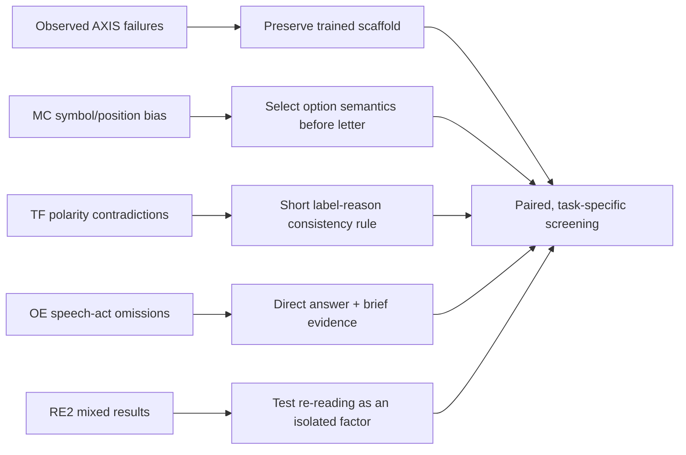

# Literature-guided prompt design survey

## Executive synthesis

The most defensible inference-only strategy is conservative: preserve the fine-tuning scaffold and test small, task-conditioned changes. The literature repeatedly shows that option labels, lexical wording, repeated instructions, and output format can all change correctness. This matches the AXIS failures, where seemingly clarifying contracts changed anomaly decisions.

## Findings by mechanism

### Time-series task prefixes

Time-LLM uses a prompt-as-prefix to inject task and domain knowledge into reprogrammed time-series models. The transferable point is to supply concise task context; it does not establish that longer natural-language evidence contracts improve a fine-tuned model. Primary source: [Jin et al., Time-LLM, ICLR 2024](https://arxiv.org/abs/2310.01728).

### MC option order and semantic binding

Pezeshkpour and Hruschka show large accuracy variation after merely reordering MC options, attributing it to uncertainty plus position bias. Zhao et al. show that prompt format and demonstrations bias answer probabilities and propose content-free calibration. Xue et al. identify weak binding between option content and symbolic labels, and improve performance by strengthening that binding. Together these motivate semantic selection before letter mapping, while warning that strict answer-letter instructions are not neutral.

Primary sources:

- [Pezeshkpour & Hruschka, NAACL Findings 2024](https://aclanthology.org/2024.findings-naacl.130/)
- [Zhao et al., Calibrate Before Use, ICML 2021](https://proceedings.mlr.press/v139/zhao21c.html)
- [Xue et al., Strengthened Symbol Binding, ACL 2024](https://aclanthology.org/2024.acl-long.237/)

### Output format can change the answer

Long et al. demonstrate that LLMs are biased toward output formats and can trade reasoning performance for format compliance. Therefore a task-specific output protocol must be evaluated as a decision intervention, not treated as harmless post-processing. This directly explains why AXIS answer-first and strict-format prompts can lower content metrics even when parse rates improve. Primary source: [Long et al., NAACL 2025](https://aclanthology.org/2025.naacl-long.15/).

### Lexical and distributional prompt sensitivity

COPLE finds large performance differences among lexically similar prompts and proposes token-level black-box optimization. ProSA models prompt sensitivity across instances and models, showing that robustness is distributional rather than guaranteed by one wording. The AXIS consequence is to use one-factor variants and require worst-dimension plus paired-decision guards.

Primary sources:

- [Zhan et al., COPLE, EMNLP 2024, DOI 10.18653/v1/2024.emnlp-main.295](https://aclanthology.org/2024.emnlp-main.295/)
- [ProSA, EMNLP Findings 2024, DOI 10.18653/v1/2024.findings-emnlp.108](https://aclanthology.org/2024.findings-emnlp.108/)

### Re-reading the question

RE2 repeats the input query after a short “Read the question again” cue and reports reasoning gains across several models. Crucially, the paper also reports mixed ChatGPT cases and suggests extra instructions can disrupt learned patterns. AXIS therefore tests RE2 independently for MC, TF, and OE, without combining it immediately with a long protocol. Primary source: [Xu et al., Re-Reading Improves Reasoning, EMNLP 2024](https://arxiv.org/abs/2309.06275).

### Why chain-of-thought is not the default

Wei et al. show strong CoT gains primarily at sufficient model scale; the headline results include a 540B model. The released AXIS checkpoint is 7B, fine-tuned to answer under a specific generation boundary, and prior outputs already exhibit formatting and contradiction failures. Explicit CoT is therefore a later controlled factor, not a presumed improvement. Primary source: [Wei et al., Chain-of-Thought Prompting, NeurIPS 2022](https://proceedings.neurips.cc/paper_files/paper/2022/hash/9d5609613524ecf4f15af0f7b31abca4-Abstract-Conference.html).

### Prompt optimization on small models

OPRO demonstrates iterative natural-language prompt optimization, but follow-up work reports limitations on Llama-2/Mistral-class 7B models and recommends clearer direct instructions. The present search adopts the iterative empirical loop, not the assumption that a meta-optimizer’s prompt transfers. Primary sources: [Yang et al., OPRO](https://arxiv.org/abs/2309.03409), [Revisiting OPRO for Small Models](https://arxiv.org/abs/2405.10276).

## Implications for AXIS Round 1

1. Keep the released prompt scaffold byte-stable except for the registered rule or repeated question.
2. Test MC semantic binding and pointwise claim checking separately.
3. Test TF minimal polarity consistency and clause/negation checking separately.
4. Test OE direct answering without prescribing anomaly direction.
5. Test RE2 by task family and in only one planned combination.
6. Reject any candidate that gains on average but loses a task family or creates closed-task correct-to-wrong transitions.
