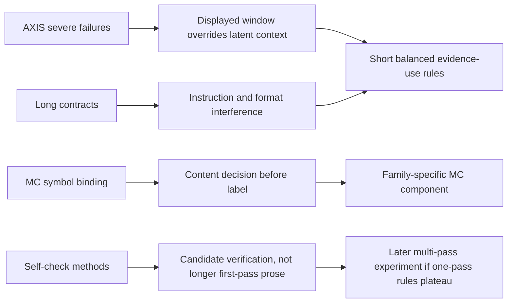

# Literature refresh for AXIS prompt research v2

## Search scope

Search date: 2026-07-27. Sources are primary papers or official proceedings
pages. The review focuses on inference-only interventions relevant to a
fine-tuned 7B time-series QA model: evidence grounding, task-family output
instructions, option binding, self-verification, refinement, and Judge
reliability.

## Evidence relevant to candidate design

### Time-series prompt prefixes

Time-LLM uses a prompt-as-prefix to inject concise task and domain context into
a reprogrammed time-series model. It supports telling the model what
representation means, but does not show that a long natural-language contract
can be inserted safely around learned AXIS soft tokens.

- Jin et al., *Time-LLM*, ICLR 2024:
  https://arxiv.org/abs/2310.01728

### MC content and symbol binding

Option ordering can change MC accuracy substantially, and weak binding between
option content and letter symbols is a distinct failure mode. Later
representation analysis supports a two-stage view: select winning content,
then bind it to the output symbol. AXIS has already tested several verbose
semantic-binding rules, so v2 tests a shorter evidence-use variant rather than
repeating them.

- Pezeshkpour and Hruschka, Findings of NAACL 2024:
  https://aclanthology.org/2024.findings-naacl.130/
- Xue et al., ACL 2024:
  https://aclanthology.org/2024.acl-long.237/
- Wong et al., Findings of ACL 2026:
  https://aclanthology.org/2026.findings-acl.1144/

### Output-format instructions are not neutral

Structured or rigidly constrained formats can reduce reasoning performance.
This matches AXIS, where a long task protocol reduced most Table-I metrics.
The v2 protocols therefore specify only the minimum answer behavior needed by
one task family and do not inject all three schemas into every question.

- Tam et al., EMNLP Industry 2024:
  https://aclanthology.org/2024.emnlp-industry.91/
- Long et al., NAACL 2025:
  https://aclanthology.org/2025.naacl-long.15/

### Re-reading, abstraction, and self-consistency

RE2, step-back prompting, and self-consistency show that small textual or
decoding changes can materially change autoregressive reasoning. Their
evidence is task- and scale-dependent. The full284 result confirms that RE2 is
a real perturbation but not an AXIS-wide Pareto improvement.

- Xu et al., *Re-Reading Improves Reasoning*, EMNLP 2024:
  https://arxiv.org/abs/2309.06275
- Zheng et al., *Take a Step Back*, ICLR 2024:
  https://openreview.net/forum?id=3bq3jsvcQ1
- Wang et al., *Self-Consistency Improves Chain of Thought Reasoning*,
  ICLR 2023: https://openreview.net/forum?id=1PL1NIMMrw

### Self-verification and self-refinement

Self-verification and Self-Refine provide inference-only multi-pass options,
but independent work shows that unaided self-critique can also collapse
performance. They motivate a later controlled candidate-selection experiment,
not an assumption that “check your answer” is harmless.

- Weng et al., Findings of EMNLP 2023:
  https://aclanthology.org/2023.findings-emnlp.167/
- Madaan et al., NeurIPS 2023:
  https://proceedings.neurips.cc/paper_files/paper/2023/hash/91edff07232fb1b55a505a9e9f6c0ff3-Abstract-Conference.html
- Stechly et al., *On the Self-Verification Limitations of Large Language
  Models*, 2024: https://arxiv.org/abs/2402.08115

### Judge reliability

G-Eval uses chain-of-thought and probability-weighted score tokens, improving
human correlation relative to earlier automatic metrics. It also identifies
LLM-evaluator bias. The AXIS overlap audit adds direct project-specific
evidence: identical `deepseek-v4-pro` score prompts do not produce identical
scores on every repeat. Final comparisons need paired repetition.

- Liu et al., G-Eval, EMNLP 2023:
  https://aclanthology.org/2023.emnlp-main.153/
- Lee et al., CheckEval, EMNLP 2025:
  https://aclanthology.org/2025.emnlp-main.796/

## Round-1 design implication

The literature and AXIS failures jointly favor the smallest intervention that
addresses the observed mechanism:

1. retain the original opening, value serialization, Local/Fixed order,
   `Overall Summary Hints` header, 30 Fixed tokens, and question-ending
   generation boundary;
2. add one short rule after the unchanged hint blocks;
3. test OE, MC, and TF components independently;
4. use a balanced statement: Per-Step Analysis can support normality or
   anomaly, and displayed magnitude alone is insufficient;
5. defer multi-pass verification until one-pass evidence-use variants have
   been falsified or a promising component needs decision repair.
